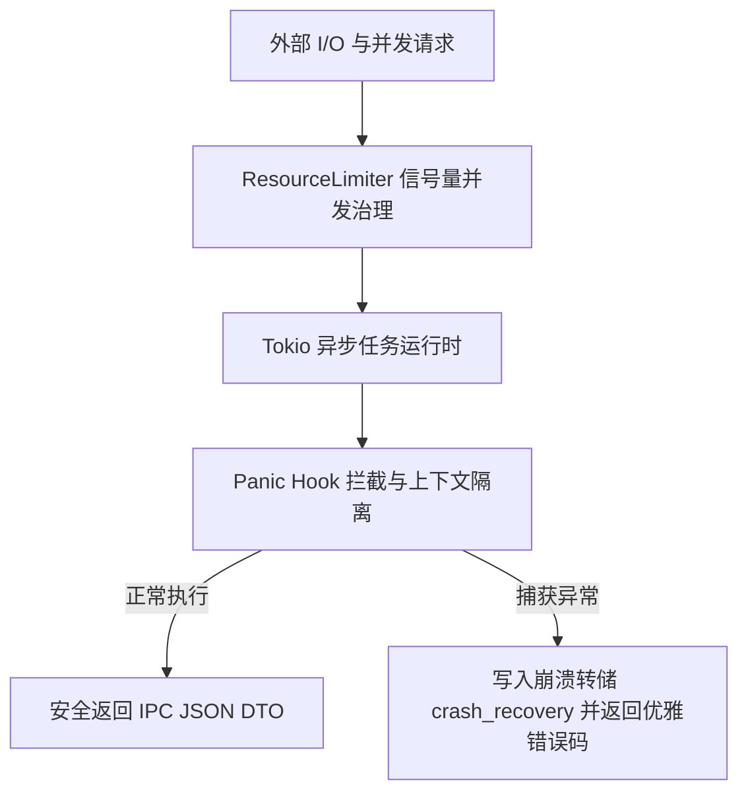

# Rust 原生引擎与分层架构设计 (Rust Native Backend Architecture)

## 1. Rust 架构定位与职责

在 Fablr 桌面体系中，Rust 充当系统的**高性能算力核心与原生系统网关**，负责所有 CPU/GPU 密集型任务与底层文件 I/O：

- **FFmpeg 原生编解码与流媒体处理**：无进程启动开销，提供极速视频帧提取与混音；
- **faster-whisper 本地 ASR 推理**：纯本地脱机语音识别；
- **SQLite 嵌入式持久化**：事务级别管理数万条切片与项目元数据；
- **高韧性资源池治理 (ResourceLimiter)**：限制并发解码线程，防止系统内存溢出。

---

## 2. 核心架构分层与 Crates 模块模型

```
src-tauri/
├── crates/
│   ├── models/           # 1. 核心模型与工作流定义 (Models & Workflows)
│   │   ├── src/lib.rs
│   │   ├── src/job.rs
│   │   └── src/platform.rs
│   ├── db/               # 2. 基础设施数据层 (SQLite Repository & Migrations)
│   │   ├── src/lib.rs
│   │   └── src/job.rs
│   └── media/            # 3. 多媒体与音频处理 (Audio, Subtitles, Semaphores)
│       └── src/utils/
├── src/
│   ├── commands/         # 4. 接口表示层 (Tauri IPC Commands / DTO)
│   │   ├── project.rs    #    项目持久化与查询接口
│   │   ├── video.rs      #    视听解码与切片接口
│   │   └── subtitle.rs   #    ASR 与字幕处理接口
│   └── lib.rs            #    Tauri 应用入口与路由注册
```

---

## 3. 高韧性保障体系 (Resilience Architecture)

为防止音视频处理过程中的原生崩溃导致应用退出，Rust 后端构建了完整的防崩溃与自愈体系：



- **Panic 拦截与防崩**：所有进入 Tauri Command 的闭包均受 `catch_unwind` 保护，单个切片解码失败不会拖垮主应用；
- **Crash Recovery 机制**：自动将崩溃前的未提交状态序列化至应用数据目录，重启时提示一键恢复。
